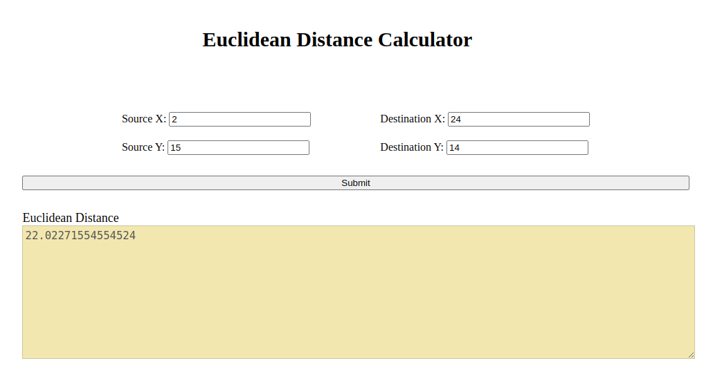

# Docker_Flask_Tutorial

**How to dockerize a Flask project:**

**Following steps are required for dockerizing:**
- [x] Install the docker: `sudo apt  install docker.io`
- [x] Create an account on dockerhub and take your USER_NAME
- [x] Create a docker file for your flask application. You can find an example [here](https://github.com/fatemehsrz/Docker_Flask_Tutorial/blob/main/Dockerfile).
- [x] Create a requirements.txt file for your application. You can find an example [here](https://github.com/fatemehsrz/Docker_Flask_Tutorial/blob/main/requirements.txt).
- [x] Build the docker image: `docker build -t USER_NAME/myflask_app:0.0.1 .`
- [x] If you have access issues run `sudo chmod 666 /var/run/docker.sock`
- [x] Run the docker image: `docker container run USER_NAME/myflask_app:0.0.1`
- [x] Check docker images: `docker images`
- [x] Push image to the dockerhub: `docker push USER_NAME/myflask_app:0.0.1`
- [x] Pull image from the dockerhub: `docker pull USER_NAME/myflask_app:0.0.1`
- [x] Run the docker image: `docker run USER_NAME/myflask_app:0.0.1`
